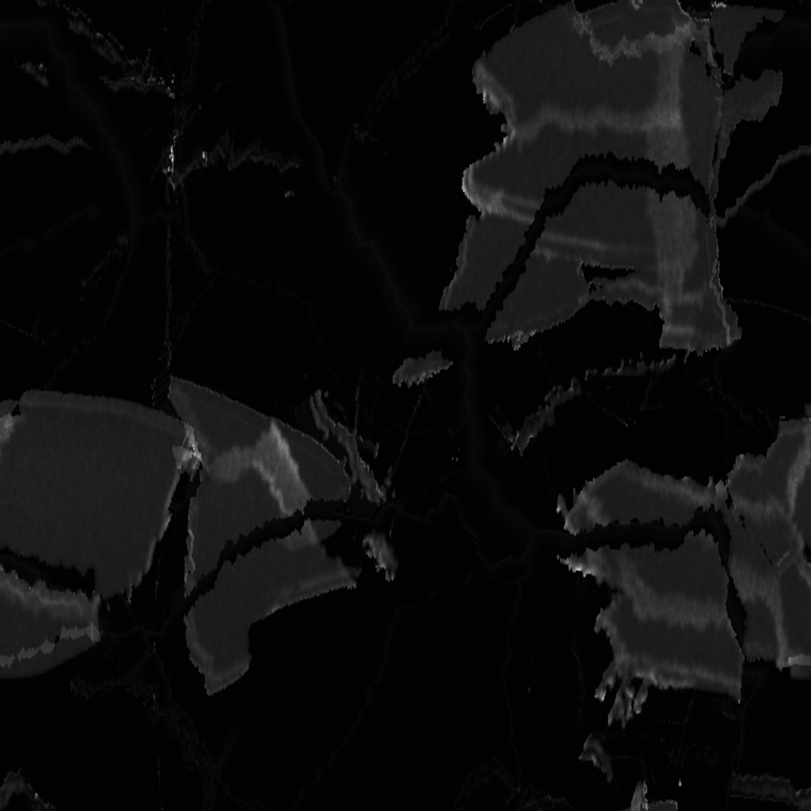
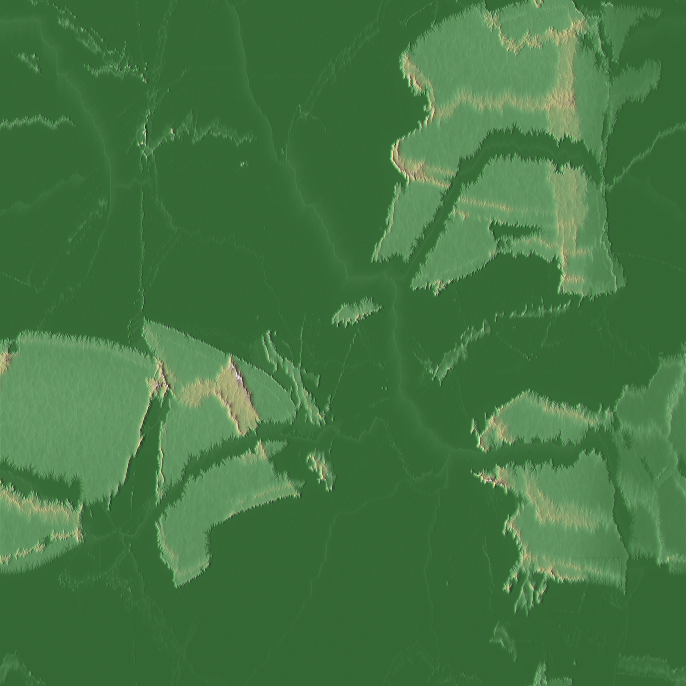

# Tiled Erosion Simulator

A ok~ish-performance, memory-efficient hydraulic erosion simulator for creating realistic terrain at massive scales.

## Current Limitations
<p align="center">
  
  
</p>

The images above demonstrates the erosion simulator working properly on a smaller heightmap. This smooth operation is typical for images up to 2048×2048 pixels, particularly at moderate scale factors (2-4x). For larger heightmaps or higher scale factors (8x+), you may encounter memory errors or stability issues as this version still has limitations with extremely large datasets. I'm working on optimizing the memory handling for massive terrains, but in the meantime, using the `--swap` and `--max-memory` options with reasonable tile sizes will help mitigate these issues. If processing very large heightmaps, consider downsampling your input or processing it in sections.

## Overview

This tool simulates the natural processes of hydraulic erosion to create realistic terrain heightmaps with detailed river valleys, mountain ridges, and natural-looking landscapes. It uses a tiled processing approach to handle extremely large maps efficiently, even on systems with limited RAM.

## Features

- **High Resolution Output**: Scale your input heightmaps up to n times their original resolution
- **Memory Efficiency**: Process massive terrains with tile-based rendering and disk swapping
- **Multithreaded**: Utilizes all available CPU cores for faster processing
- **Physically-based Simulation**: Models rainfall, water flow, sediment transport, and deposition
- **Detailed Control**: Fine-tune every aspect of the erosion process
- **Automatic Visualization**: Creates shaded relief maps of the output terrain

## Requirements

Follow the main README.

## Basic Usage

```bash
python tiled_erosion.py input_heightmap.png
```

This will process the input heightmap with default settings (4x scale, medium detail) and generate:
- A .npy file with the processed terrain data
- A grayscale PNG of the terrain
- A hillshaded visualization

## Command Line Arguments

```
python tiled_erosion.py input_file [options]
```

### Required Arguments:
- `input_file`: Input heightmap file (PNG, JPG, or NPY)

### Common Options:
- `--output/-o`: Output filename prefix (default: 'detailed_erosion')
- `--scale/-s`: Scale factor for resolution (default: 4.0)
- `--iterations/-i`: Number of erosion iterations (default: auto-calculated)
- `--processes/-p`: Number of CPU cores to use (default: all available)
- `--verbose/-v`: Enable detailed progress reporting
- `--quiet/-q`: Suppress all but essential messages

### Memory Management:
- `--swap`: Use disk for temporary storage (recommended for high-res processing)
- `--max-memory`: Maximum memory usage in GB (auto-enables swap if needed)
- `--local-swap`: Store temporary files in the script directory
- `--swap-dir`: Custom directory for temporary files

### Advanced Options:
- `--tile-size/-t`: Base size of individual tiles (default: 1024)
- `--overlap`: Overlap between tiles in pixels (default: 192)
- `--planet-diameter/-d`: Diameter of planet in km (default: 12742.0 - Earth)
- `--force-square`: Force the input image to be square

## Examples

### Basic Processing
```bash
# Process a heightmap at 2x resolution
python tiled_erosion.py heightmap.png --scale 2.0
```

### High-Resolution with Memory Management
```bash
# Process a heightmap at 8x resolution with disk swapping
python tiled_erosion.py heightmap.png --scale 8.0 --swap --verbose
```

### Memory-Constrained Systems
```bash
# Limit memory usage to 4GB, automatically enabling swap if needed
python tiled_erosion.py heightmap.png --scale 4.0 --max-memory 4.0
```

### Massive Terrain Generation
```bash
# Process a large heightmap with 8 compute threads, local swap files
python tiled_erosion.py heightmap.png --scale 16.0 --processes 8 --swap --local-swap
```

## Tips for Best Results

1. **Input Quality Matters**: Start with a good base heightmap (at least 1024x1024 pixels)
2. **Memory Management**: For scales above 4x, use the `--swap` option to prevent crashes
3. **Processing Time**: Higher scales take longer; 8x typically needs hours, 16x may need days
4. **Iteration Count**: More iterations create more erosion detail but take longer
5. **CPU Cores**: Use slightly fewer cores than available (e.g., 12-14 for a 16-core system)
6. **Square Maps**: For best results, use square heightmaps

## License

This project is licensed under the GNU Affero General Public License v3.0 (AGPL-3.0) - see the LICENSE file for details.

## Acknowledgments
This implemtentation is uses alot from:
- https://github.com/dandrino/terrain-erosion-3-ways
The main improvements are memory handling, scaling and tiling.
